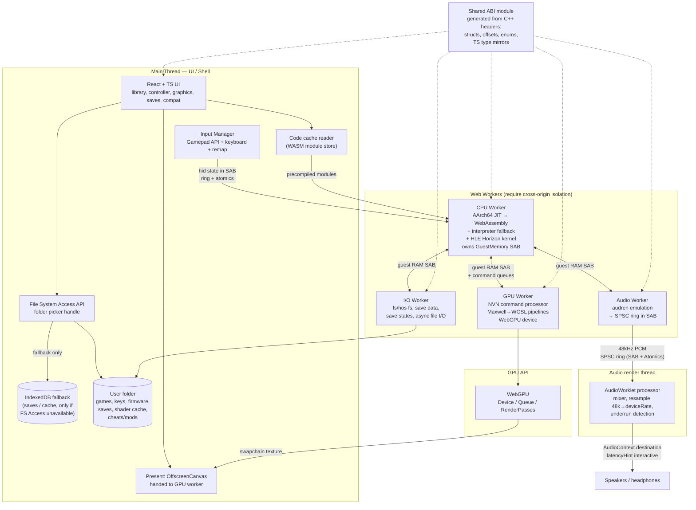
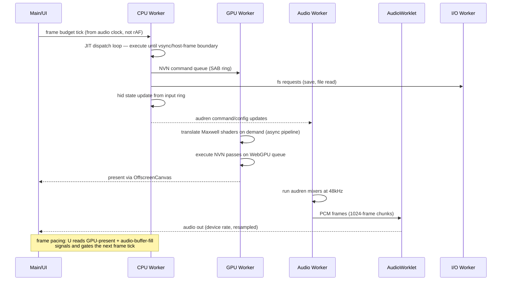

# Architecture — Browser-Native Nintendo Switch Emulator (Pokémon-Focused)

**Status:** Architecture only — no implementation code in this document. Short interface sketches
(type signatures) appear where they clarify a design decision.

**Product shape:** A 100% client-side web application. No server performs emulation, no user data
leaves the device, no game content is fetched by the app or by us.

**Reference points:** Yuzu, Ryujinx (design lineage: HLE Horizon, NVN/Maxwell, AArch64 JIT), plus
web-platform work on in-browser JIT compilation, WebGPU shader pipelines, and cross-origin isolation.

---

## Part 0 — Non-negotiable legal and content boundaries

These are hard architectural constraints, not policy preferences. They shape Parts 1, 3.1, and 3.8.

| Constraint | Architectural consequence |
|---|---|
| No bundled/linked/downloaded ROMs, firmware, or keys | The app ships as bytes only. The NCA/XCI parser, key derivation, and NCA decryption run client-side on user-supplied bytes. No content manifest, no CDN fetch of game data, no "first run" download. |
| User supplies their own legally dumped game | Game installs live in a **user-chosen local directory** picked via `showDirectoryPicker()`. Nothing is written outside it (plus the folder-picker-granted origin storage). No IndexedDB mirroring of game content. |
| User supplies `prod.keys` | Read via a **file picker** (`<input type="file">`), held in memory or in the chosen directory, never uploaded, never persisted to origin storage unless the user explicitly saves it into the picked folder. A `keys.txt` in the picked directory is preferred over OS keyring. |
| User supplies firmware | Same as keys: path in the picked folder, or explicit picker. Optional in one of the two supported boot models (see Part 3.4). Never fetched. |
| Everything stays local | No telemetry, no analytics, no crash-upload, no CDN for game content, no service worker fetching anything but the app shell. |
| No circumvention of access controls in shipped code | We ship a *generic* content-mounting path. The app does not include title keys, does not "identify" specific titles for the purpose of pulling keys, and does not include any title-specific key blob. |

**Compliance checklist (must pass before any release):**

1. Repo and release artifacts contain zero bytes of Nintendo-derived data.
2. CI greps the artifact tree for known key/ROM file signatures (`header_key` at `0x100`+`0xC00`+... =
   `0x1000`/`0x2000` magic, `XCI`/`NSP` container magic, `prod.keys` key names as *filenames only*).
3. First-run UI states the user must own the game; "I own this game" checkbox gates install scanning.
4. No outbound network calls at runtime other than loading the app shell (verified by CSP
   `default-src 'self'`).
5. Region/lock: respect the NCA `rights_id` (from `prod.keys`) and refuse to mount content whose
   rights ID is not present in the user's key file — matches the hardware behavior and avoids us
   "fixing" region locks.

**Key derivation flow (client-side, generic):**

```
prod.keys (user file)
   ├── keyblob[master key source]  +  TSEC-derived key  (from keys: keyblob_key_source, tsec keys)
   │        └── master key (aes-128-ecb) decrypts per-title key_area keys
   ├── titlekey[title_id] = encrypted title key  (from keys)
   └── xci_header_key, aes_kek_generation_source, ...
                  │
                  ▼
   per-title key_area (application/ocean) → AES-CTR / AES-XTS key schedules
                  │
                  ▼
   NCA section decrypt (partition / exefs / romfs / update / data)  →  mountable image
```

`key_area` layout is standard: application key, ocean key, and the first 4 KB of `header_key` (derived)
plus the master-key-wrapped key at `0x200` region for hardware-encrypted titlekeys. We implement this
generically; no per-title data ships.

---

## Part 1 — Executive summary with feasibility verdict

### 1.1 The one-paragraph verdict

A Switch emulator that is *playable for Pokémon titles* in a browser is **achievable for two of the four
target titles, expensive but not impossible, and not a weekend project.** The three things that decide
whether it works are: (1) an AArch64 JIT that emits WebAssembly fast enough to hide compile cost, (2) a
64-bit-compatible guest memory model inside the browser's 32-bit (or 64-bit) WASM heap, and (3) a
Maxwell→WGSL shader path with a cache that survives across sessions. The web platform is *good enough*
today: WASM SIMD, bulk memory, tail calls, cross-origin isolation + SharedArrayBuffer, OffscreenCanvas,
WebGPU, and File System Access give us every primitive we need. The web platform is *not* kind to us on
two axes: there is no `mmap(PROT_EXEC)`-style memory, so W^X is irrelevant but so is any escape hatch
for self-modifying guest code, and W^X-adjacent ergonomics mean our "code cache" must be generated
WASM modules rather than machine code, which changes the JIT's economics fundamentally (Part 3.2).

### 1.2 Per-title feasibility (ranked, hardest-last)

| Rank | Title | Engine | Native fps target | Difficulty | In-browser verdict | Recommendation |
|---|---|---|---|---|---|---|
| **1** | **Let's Go Pikachu / Eevee** (2018) | Unity (IL2CPP) | 30 (locked 30 in most gameplay; occasional 60 in battle) | **Lowest** — single-region scenes, tiny streamed data, small shader set, no open world, modest VRAM (~1 GB era), mature and well-understood | **Realistic.** Unity titles are the friendliest target: no engine-level custom renderer surprises, small fixed-function surface, low shader count, and a 30 fps target leaves ~2x headroom on the CPU budget we can realistically reach | **Support first.** Boot to credits / playable overworld is an achievable milestone |
| **2** | **Sword / Shield** (2019) | Unreal Engine 4 | 30 (locked, with dynamic resolution 720p–1080p) | **Medium** — UE4 brings a heavy renderer, many large shaders, deferred-ish passes, and aggressive multithreading, but the 30 fps lock and region-scoped streaming are big wins | **Plausible, effort-heavy.** The 30 fps lock is decisive: we need ~50% of Switch's real GPU/CPU throughput, which is reachable in WebGPU on a discrete GPU but *not* on integrated graphics at native resolution (mitigation: default resolution scale 0.5–0.66) | **Second.** The first genuinely "real game" milestone |
| **3** | **Legends: Arceus** (2022) | Unreal Engine 4 | 30–60 (dynamic resolution, large open world) | **High** — large streaming open world, aggressive dynamic resolution, more shaders than SwSh, heavy I/O streaming pressure | **Unlikely.** The combination of streaming, DRS feedback loops (our timing jitter feeds the game's resolution scaler), and a shader count that must all compile before a stable frame is a brutal first target | **Phase 5+, stretch.** Worth attempting only after SwSh is genuinely playable |
| **4** | **Scarlet / Violet** (2022) | Unity (IL2CPP, modern Unity) | 60 | **High** — modern Unity renderer features, very large open world with aggressive streaming, and a 60 fps budget on a *smaller* shader count than UE4 titles | **Least likely of the four**, and note the irony: it is Unity like Let's Go, but the 60 fps target + modern Unity renderer features + open world make it harder than the UE4 titles. Unity's advantage is engine simplicity, not performance | **Phase 6 / out of scope for v1** |

**Note on "reach the 30 fps lock as an advantage."** A locked 30 fps target is a 2x budget discount
versus a locked 60 fps target *only if* the game's GPU cost dominates. For Switch titles it usually
does, and the CPU side (4× Cortex-A57) is the part our JIT must replace. A JIT reaching ~40–60% of
native A57 throughput is enough for 30 fps titles and definitively not enough for 60 fps titles. This
is the single most important fact in the document.

### 1.3 Subsystem feasibility summary

| Subsystem | Feasible in-browser today? | Expected performance | Biggest risk |
|---|---|---|---|
| Loader / content layer | **Yes**, comfortable | Boot → mounted title in seconds; ROMFS/RootFS directory scans are I/O-bound and fast | NCA AES-CTR throughput in JS if not done in WASM (mitigate: bulk decrypt in WASM, ~1 GB/s achievable) |
| CPU (AArch64 JIT → WASM) | **Yes, but this is the project** | Interpreter: 20–50 MIPS. WASM-emitting JIT: 200–800 MIPS on desktop class hardware | Compile latency vs. block granularity vs. WASM module instantiation cost; guest SMC and exception edge cases |
| Memory / MMU | **Yes, with care** | Sparse paging in WASM is fast (direct typed-array indexing); TLB hit path ~ a few instructions | 32-bit WASM heap limit (4 GiB) vs. Switch's 36-bit physical / 48-bit virtual space; SAB growth detaches views |
| Kernel / HLE | **Yes** — this is well-trodden | Negligible overhead if written carefully; SVC dispatch adds ~1–3% CPU | Breadth, not depth: the long tail of service IPC shapes for one specific game |
| GPU (NVN + Maxwell) | **Yes** — the hardest *correctness* work, the best *known* shape | WebGPU on discrete GPUs has ample headroom for 30 fps Pokémon; integrated GPUs will need resolution scale | Shader translation fidelity (Maxwell quirks, denormals, no-robust-buffer-access semantics) and compile *latency*, not throughput |
| Audio (audren) | **Yes** | Underruns are the failure mode; 1024–2048 sample ring with a 3-buffer queue is comfortable | Real-time correctness: any GC pause or SPSC-queue bug = audible crackle; must run audren on its own thread with a hard real-time budget |
| Input | **Yes, easiest subsystem** | Sub-millisecond | Nothing technical; it's all design and polish (remapping, gyro) |
| Storage / saves | **Yes** | File System Access is reliable in Chromium; Firefox lacks it → IndexedDB fallback | Save-corruption on crash mid-write → need atomic write (temp + rename) |
| Threading / perf | **Yes, with mandatory headers** | 4 cores usable in Chromium; Firefox SAB ergonomics vary | COOP/COEP means the app **cannot be served from a plain static host without headers** — see Part 3.9 |
| UI / shell | **Yes** | N/A | The classic trap: spending the project's budget on a beautiful frontend instead of a JIT |

### 1.4 Verdict statement

- **V1 (realistic):** Let's Go Pikachu/Eevee playable end-to-end — boot, overworld, battles, save/load,
  save states, 30 fps on discrete desktop GPUs.
- **V2 (realistic, larger):** Sword/Shield at 30 fps with default resolution scale < 1.
- **V3 (stretch):** Legends: Arceus. **V4 (research):** Scarlet/Violet.
- **Risk-adjusted honest note:** The CPU JIT and the GPU shader pipeline are each roughly a
  multi-engineer-year problem to get to *correct*, and 2x that to get to *fast enough for a 60 fps
  modern title*. V1/V2 are within reach of a small team that already knows emulator internals; V3/V4
  are not, for a browser-only project.

---

## Part 2 — High-level architecture (Mermaid)

### 2.1 Process and thread topology



### 2.2 Data flow: one frame



**Two non-obvious flows worth calling out:**

1. **Frame pacing is audio-master, not `requestAnimationFrame`.** `rAF` on a 144 Hz monitor would invite
   the guest to run unthrottled. We gate frame submission on the audio ring's fill level plus the
   guest's own VSync interval (the game calls `nvsync`/`nvidiaSetVsync`/`vcmpSetVSync` and we honor it).
   This means a 30 fps-locked game stays at 30 fps regardless of monitor refresh.
2. **The JIT's code cache is a file, and it is the single highest-leverage cache in the project.** Part 3.2
   and 3.5 both depend on it: after the first run, cold code is compiled offline (in a worker, while the
   game boots), so frame time never pays compile cost again.

---

## Part 3 — Subsystem designs

### 3.1 Loader / content layer

**Responsibilities**

- Parse and mount content: `.xci`, `.nsp`, `.nca`, `.nso`, `.nro`, and raw ExeFS/RomFS dumps.
- NCA header validation, key-area selection, per-section AES-CTR/AES-XTS decryption with the correct IV
  and section-offset handling.
- RomFS virtual-directory construction; ExeFS (`.nso` + meta) mounting; NSO load-segment relocation and
  import resolution (via `nso` dynamic symbol stubs we export).
- Title metadata: title ID, name, publisher, version, icon, required system version, DLC/base detection,
  and the `rights_id` check against the user's keys.
- Base/update merge semantics (`ns0` / `base` / `update` merge trees), save-data path derivation, and
  content-location resolution for `fs` IPC (`ns0:/`, `save:/`, `data:/`, `cache:/`).
- Emit a `LoadResult` consumed by the rest of the system: memory regions, entry point, system-module set,
  and the `TitleContext` that selects HLE service behavior.

**Key data structures** (sketch; the C++ side is the source of truth — see Part 4.4)

```cpp
struct TitleKey { u128 key; std::array<u8,16> rights_id; };

enum class SectionFsType { RomFS, ExeFS, Partition, Update, Manual };

struct NcaSection {
    u64 media_offset, media_size, offset, size;
    SectionFsType fs_type;
    NcaAesAlgorithm algo;             // None | Ctr | Xts
    Aes128CtrKey ctr_key;             // key + generation counter
    Aes128XtsKey xts_key;             // key + generation counter
    Sha256Hash hash;
    bool has_sector_hash;
};

struct NcaFile {
    u64 id;                           // 0x100000000 + ncaId
    TitleKey key;
    std::vector<NcaSection> sections;
    RightsId rights;
    NcaHeaderProgramType program_type;
};

struct RomFsDirectory { u32 parent, sibling; u32 file_offset, file_size; bool is_dir; };
struct RomFsFile      { u32 parent, sibling; u64 data_offset; u64 data_size; u32 flags; /* packed/bc/compr */ };

struct RomFsImage {                 // flattened for cache-friendly lookup by dense id
    std::vector<RomFsDirectory> dirs;
    std::vector<RomFsFile>      files;
    std::vector<u8>             data;       // decrypted; NOT resident in full (see note)
    std::vector<u32>            hash_to_id; // open-addressed: name-hash -> id
};

struct PathMount { std::string name; RomFsImage* fs; /* RO */ std::string host_dir; /* RW, for save/data/cache */ };

struct MountSet {                  // the "root" of a running title
    std::vector<PathMount> mounts; // "romfs:/", "save:/", "data:/", "cache:/", "ns0:/"
    u64 title_id, program_id, version;
    u32 entry_point;               // ExeFS meta / NSO text base + entry offset
    bool requires_firmware_boot2;  // see Part 3.4
};

struct LoadResult { MountSet root; std::vector<NcaFile> sysmodules; KeyScheduleRing keys; TitleMeta meta; };
```

**Technology choice.** Container/NCA parsing is pure computation and belongs in the core (WASM).
RomFS *metadata* is flattened into vectors (cheap, hot). RomFS *data* (4–14 GB for a Pokémon install)
is **not** held in RAM: it is served through a caching block reader over the decrypted container on the
user's disk, with an LRU page cache in the shared arena (Part 3.3). Decryption throughput target:
AES-CTR ~1 GB/s in WASM with a SIMD XOR path, applied once at mount in cancellable chunks with a
progress bar.

**Threading.** Mount runs on the **I/O worker** (it touches the filesystem and is not latency-critical),
publishes the finished metadata + key schedule into the shared buffer, and signals the CPU worker via
the event queue. Alternative rejected: doing it on the main thread blocks the shell for ~10 s on a
14 GB install.

**Pokémon-specific content notes**

- All four targets are NSO-based (not NRO), so `ExeFs → main NSO` mapping is the hot path.
- Base/update merging must be implemented properly; bugs produce "missing content" symptoms that get
  misdiagnosed as shader or I/O bugs. This gets a targeted test in Phase 2.
- `save:/`, `data:/`, `cache:/` must be backed by the user's directory with correct write semantics
  (Part 3.8), because Pokémon writes frequent small save blobs.

---

### 3.2 CPU — ARM Cortex-A57 (AArch64) emulation

This subsystem decides whether the project is viable. Everything else is engineering; this is research.

#### 3.2.1 The fundamental constraint, stated plainly

Native emulator JITs (Yuzu/Ryujinx) emit **host machine code** into an executable page and jump to it,
using W^X (write `RW` → `mprotect` `RX`). A browser offers no equivalent: we cannot emit x86-64/ARM64,
and we cannot emit WebAssembly *source* at runtime and have the engine lazily compile it — every
`WebAssembly.Module` we execute must exist as bytes beforehand, and `WebAssembly.instantiate` is
synchronous and costs real time.

So the design question is not "how do we JIT" but **"what is the cheapest unit of WebAssembly we can
compile, execute, and discard, given that compiling anything costs?"**

#### 3.2.2 Options compared

| Option | Mechanism | Throughput (est.) | Compile cost | Verdict |
|---|---|---|---|---|
| **A. Threaded interpreter** (WASM-hosted, direct-threaded over a `u32` opcode space) | Guest instructions decode to a flat `u32` array, executed by a dispatch loop. In WASM this becomes a `br_table` over ~1–2k opcodes, which the browser JIT lowers to a real jump table — fast *for an interpreter*. | **20–50 MIPS** | Zero | **Not sufficient as primary.** A 4×A57 @ ~1 GHz Switch sustains 500–1500 MIPS for a UE4 title; one interpreter thread at 40 MIPS is 20–30× short. Keep as fallback + test oracle. |
| **B. WASM-emitting JIT, one module per basic block** | Each guest block → a WASM function; wrap in a module with shared memory imported; instantiate and call. | 200–800 MIPS of execution | Instantiation ≈ tens of µs per block; module ≈ few KB | **Rejected as primary.** Instantiation is 10–100× too slow for a 2–5 µs block. This is the trap a naive port of a native JIT falls into. |
| **C. WASM-emitting JIT, one module per *superblock*, instance swap** (recommended) | Greedily chain blocks into superblocks (traces, loop bodies, straight-line cold code). Emit one module containing many superblocks; instantiate when the working set changes; dispatch internally by index. | 200–800 MIPS steady-state | Amortized across thousands of guest instructions; first-run cost is seconds–minutes, hence the on-disk cache (Part 3.2.5) | **Recommended primary.** One instantiation covers a large working set. |
| **D. Ahead-of-time precompile** | Compile all reachable guest code to WASM offline. | ≈ native | Enormous; needs whole-program analysis of a commercial title we don't ship | **Rejected.** Also just "do the work before the user runs it" with extra steps. |
| **E. Hybrid: JIT + interpreter** (recommended *shape* = C + A) | Hot code → WASM superblocks; cold/rare/invalid code → interpreter. SMC/unmapped-exec → interpreter until resolved. | Best of both; interpreter gives a correctness floor where the JIT bails | Low | **Recommended.** Also enables a strong self-check: execute a block both ways and compare state. |

#### 3.2.3 Recommended design

**All architectural state lives in a `SharedArrayBuffer` struct — never in WASM locals.** This is
mandatory: code units are separately instantiated modules, so there is no shared register file across
them. Every emitted function reads/writes `GuestContext`:

```cpp
struct GuestContext {            // one per emulated core; laid out for cache friendliness
    u64 x[31];                   // x0..x30
    u32 sp, pc, pstate;
    u32 cpsr_flags;              // packed NZCV
    u32 tpidr_el0, tpidrro_el0, fpcr, fpsr;
    // v0..v31 (32 x 128b = 512B) last, 64B-aligned: SIMD must not false-share with the int regs
};
```

Consequence: each register access in JIT-emitted code is a memory access off one base pointer, costing
roughly one extra load versus native. Mitigations that actually matter:

- Keep `GuestContext` hot: load `x[i]` into a WASM local at function entry, write back at exit — the
  round trip is paid only at superblock boundaries.
- Order `v[]` last and 64-byte aligned.
- Use **WASM SIMD (`v128`)** for guest FPSIMD/NEON translation and for hot memory-move helpers. Supported
  in all target browsers today; treat it as a hard requirement for v1, not an optimization.

**Dispatch and block chaining**

- *Within a module*: superblocks dispatched by dense index through `call_indirect` from a generated
  dispatcher.
- *Across modules*: each superblock function returns a small result code (`NextBlock`, `Return`,
  `Exception`, `SMC`, `Unmapped`, `Exit`). The interpreter-level loop sees the code, consults the block
  cache, and either re-enters the same module or swaps to the module owning the next superblock. A swap
  is just a call into another instance — cheap, because state lives in SAB and every module imports the
  same memory.
- **Stack depth.** Guest call stacks are deep (UE4 recursion). Two mechanisms: (1) inline small hot callees
  *inside* a superblock with a depth budget (bounded inlining, e.g. depth 4); (2) for returns that must
  leave a module, use **WASM tail calls** (`return_call_indirect`, Chromium 112+/Firefox 121+) so host
  frames don't grow. Without tail calls, fall back to a trampoline with an explicit shadow stack in SAB.
  This is the classic way a WASM-hosted guest stack overflows — test it explicitly (Phase 2 gate).

**Superblock formation**

- Greedy trace construction: chain hot successors, append loop bodies while the profile says hot,
  tail-duplicate small hot successors, inline hot callees under a budget.
- **Never trace across:** guest SMC writes, MMIO reads with ordering side effects, unmapped pages,
  `ISB`/`DMB`/`DSB` boundaries that matter, and instructions that can raise (divide by zero, SVC).
- **PGO-lite:** an execution-count table in SAB decides hotness; counts are persisted in the on-disk
  cache so run 2 traces better than run 1.

**Self-modifying code and code caches**

Guest SMC is rare but real. Rules:

- Guest writes are ordinary memory writes; they can never alias our emitted WASM code, because WASM code
  is immutable from our side. **This is the one genuine W^X-shaped advantage the platform gives us** —
  we never need `mprotect`, never invalidate an icache, and never worry about a writable-executable page.
- An SMC write to a page containing translated blocks → bump that page's generation counter, invalidate
  blocks whose PC is in it, drop the containing superblock, fall back to the interpreter until the new
  code is translated. Slow but correct.
- Guest code executing from a *writable* page is handled identically (generation + invalidation).

**Other invalidation triggers:** MMU executable-permission changes; TLB fills on cold pages; any HLE call
that can patch guest code. Each tracks block→page membership in a compact map.

**Block cache data structures**

```cpp
struct BlockKey { u32 page; u32 offset; u32 gen; };   // guest-addressable identity + generation
struct Block {
    BlockKey key;
    u32 superblock_index;      // index within the owning module
    u32 instr_count;           // guest instructions covered
    u8  flags;                 // Hot, HasCall, Returns, Traced, ContainsSimd, Compiled
    u32 next[2];               // static successors filled at trace time
};
struct CodeCache {             // SAB-resident
    std::vector<Block>   blocks;
    std::vector<u32>    block_hash;   // power-of-two, linear probing, sharded by page
    u32 superblock_count;
    std::vector<u64>    exec_counts;  // PGO-lite, persisted to disk
    PageGenerationTable page_gen;
};
struct ModuleSet {             // lives in the JIT/exec worker
    std::vector<uint8_t> wasm_bytes;              // concatenated modules
    std::vector<WebAssemblyModuleHandle> modules; // instantiated
    u32 active_module;                            // current instance
};
```

#### 3.2.4 Threading model for the CPU

Two topologies:

- **Topology 1 (recommended for v1): one CPU worker owns everything** — guest memory, JIT translation,
  execution, kernel HLE. The guest's four A57s become four *interleaved contexts in one host thread*
  (round-robin at safe points, with a fast path "run the current core until it blocks or its slice
  expires"). Loses maybe 10–25% versus true parallelism, and at a 30 fps target that trade is worth it.
  The single biggest simplification win available.
- **Topology 2 (v3+): one CPU worker per guest core**, sharing guest RAM via SAB, with lock-free SPSC
  queues per pair (guest atomics → `Atomics.*`). Needed for UE4's parallel render/worker threads. Costs:
  guest spin-loops become `Atomics.wait` wake storms; false sharing on shared TLB/page tables is a real
  cliff; guest atomics must be genuine `Atomics`. Requires a sharded TLB plus a shared walker under a lock.

**Recommendation:** Topology 1 through Phase 4; prototype Topology 2 in Phase 5 (a prerequisite for
Arceus/SV).

#### 3.2.5 Getting the compile cost off the critical path

Three mechanisms, all required:

1. **Persistent code cache on disk** (`cache/code/<titleId>/<hash>.codeblock`): the compiled WASM
   modules + block table + exec counts. Boot loads it; nothing recompiles.
2. **First-run background pre-JIT:** after mount, a boot-time pass traces likely-hot code (entry points,
   init paths, and — after a first partial run — the recorded hot set) while the game boots, using idle
   workers. Cold code compiles on first encounter, in the interpreter's shadow, at interactive rates.
3. **Never block a frame on compile.** A cold block translates inside the dispatch loop (paying microseconds),
   and only superblock *compiles/instantiations* are deferred to a batch point or the background pass.

#### 3.2.6 Verifying the JIT is correct (the highest-value test harness)

Differential-test against QEMU user-mode and Unicorn: run the same guest binary and input for 100M+
instructions, comparing full architectural state (all regs, flags, memory) every N instructions, with
mismatch replay to the exact instruction. This must exist **before** the first commercial title boots.
Alongside it: an in-house conformance suite (integer/FP/SIMD/branch/memory/exception instruction sets),
because QEMU oracles alone don't tell you *which* instruction is wrong.

---

### 3.3 Memory / MMU

**Virtual address space.** AArch64, 4 KiB/64 KiB granules, TCR_EL1 configured by the guest kernel.
Switch titles use a fairly static mapping. Model the full space with a two-level page table plus a
dense fast path, exactly like Yuzu: a per-core TLB keyed by `(vpn, asid)` in front of the walk.

**The 32-bit problem.** WASM32 linear memory is capped at **4 GiB** (65 536 × 64 KiB pages). The Switch's
guest-visible *physical* memory is ~4 GiB max, and its *virtual* space is 48 bits. Neither fits "natively"
in a 32-bit address space if you also want ROMFS metadata, framebuffers, JIT code, audio rings, and your
own code in the same heap.

| Approach | How | Pros | Cons |
|---|---|---|---|
| **P1. Sparse page table over a resident arena** (recommended baseline) | TLB maps guest page → offset in a **dense arena** holding only *resident* pages; guest physical address = arena offset. Unmapped regions cost nothing; the arena grows via `memory.grow`. | Simple, TLB lookup is one indexed load, no per-page allocation, works on WASM32 today | Arena still capped below 4 GiB with headroom for everything else; SAB growth **detaches all views** (must re-create) and can be tricky with module memory imports; needs a resize protocol |
| **P2. `WebAssembly.Memory64`** | 64-bit WASM memory; pointers are `i64`; guest physical space maps 1:1. | Direct mapping, no arena indirection, no artificial limit | Engine/toolchain support is newer and less uniform than WASM32 (Chromium has shipped it; Firefox availability varies); the C++ core, Emscripten build, and generated JIT code must all be 64-bit-clean; higher toolchain risk for zero v1 benefit |
| **P3. 32-bit tagged address + high-bit side table** (Yuzu-on-32-bit trick) | Host address = `(dense_page_index << 12) \| offset`, physical identity kept out-of-band. | Fits WASM32 comfortably | Extra indirection on *every* access, worse JIT code quality, subtle bugs under concurrency |

**Recommendation:** build **P1**, keep the model behind a narrow interface so **P2 is a near-drop-in upgrade**
(it changes one function: guest physical address → host location). Do not bet on Memory64 for v1.

**RomFS does not live in RAM.** A Pokémon install is 4–14 GB. Decrypted RomFS data is served from disk
through a **caching block reader** with an LRU page cache plus read-ahead (RomFS access is highly
sequential), not as a byte array. Reads are synchronous from the guest's perspective, so performance
comes from caching and prefetch, not from async I/O. Under memory pressure, allow the page cache to
shrink (guest out-of-memory becomes a real, emulated OOM rather than a host OOM).

**64-bit guest addresses inside 32-bit WASM.** Guest *values* are `u64`/`i64` in WASM locals — the CPU
emulation has no problem with 64-bit registers, only with 64-bit *addresses*. Under P1 the TLB key
stores the high bits, so 64-bit guest addressing costs nothing extra and emitted JIT code handles it
for free. Only the *host* representation stays 32-bit. This is the clean outcome of P1 and the reason
to prefer it over fighting the toolchain.

**Key data structures**

```cpp
enum PageState : u8 { Unmapped, Resident, Shared, Reserved };

struct GuestMemory {
    u8* arena;                              // SAB-backed, growable; arena offset == WASM ptr
    std::vector<u32> page_state;            // per guest physical page -> arena page index
    std::vector<u32> page_table;            // [asid][l1][l2] -> physical page (0 = unmapped)
    struct Tlb { std::vector<u32> tags, frames; };
    Tlb tlb[MAX_CORES];
    u64 total_resident_bytes, arena_bytes;
};
```

**Guest atomics and cross-thread coherence.** In Topology 1, single-threaded fast paths with assertions
that detect multi-core guests early (a cheap, valuable diagnostic). In Topology 2, guest
LDXR/STXR/atomics map onto host `Atomics.*` against the shared arena so genuinely parallel guest code
works.

**Threading.** Guest RAM is a single SAB owned by the CPU worker, shared read/write with GPU, audio, and
I/O workers. Ownership discipline: the CPU worker is the single writer for MMIO regions; other workers
read guest RAM (textures, audio source memory) and post commands rather than mutating state. MMIO writes
go through an ordered queue so device side effects stay deterministic.

---

### 3.4 Kernel / HLE layer

**Boot models (a real fork in the road):**

- **Model A — "HLE kernel, skip boot2" (Yuzu-style; recommended).** Do not execute the boot ROM or
  boot2. Synthesize a minimal kernel: build the initial address space, load system modules, and run the
  title's `main` NSO entry with an HLE service environment already present. **Requires `prod.keys`; system
  firmware is optional** (used if present, for cert stores and later boot2). Boot is nearly instant.
- **Model B — "execute boot2 from firmware" (Ryujinx-style).** Requires real system firmware, executes the
  second-stage bootloader, reaches the title via the real path. Higher fidelity, much slower boot, and a
  whole class of early-boot debugging. **Not for v1.**

**Recommendation:** Model A, with the code structured so Model B is a later flag (the
`requires_firmware_boot2` field already sketched in Part 3.1). This maximizes what runs with the least
user friction and honors "firmware optional."

**Responsibilities**

- `SVC` dispatch: decode `svc #imm16`, route to kernel HLE.
- **Threads:** create/start/exit/priority/context, and scheduling across emulated cores (cooperative in
  Topology 1, per-core workers in Topology 2).
- **Synchronization:** mutex, condvar, semaphore, event, timed wait, and barrier instructions. Blocking a
  guest thread must never block a host worker — implement as "park this guest thread and switch."
- **Memory management:** guest `mmap`/`munmap`/`mprotect`/`mmapIo` into the page-table model, including
  executable-page transitions (this is the SMC/JIT coupling from Part 3.2).
- **IPC:** `svcSendSyncRequest`, system tick, interrupt monitor, named ports; port-based client/server
  model; interrupt objects and event signalling waking parked threads.
- **HLE services (the user-space half):** each service is an IPC command dispatcher mapping command IDs to
  C++ handlers over host state. This is where most of the real work lives.
- **Timing:** system tick (ns), steady clock, and the profile counters the game reads for
  dynamic-resolution decisions. Accuracy here directly affects the *visual* outcome of DRS (Part 4).

**Service prioritization for Pokémon titles.** Ordered by "the title will not boot / will visibly break
without it."

| Priority | Service | Purpose | Pokémon relevance |
|---|---|---|---|
| **P0** | `fssrv` + `fs` | File system (service + client IPC) | Saves, RomFS reads, caches; everything |
| **P0** | `ldr` | Loader / process memory / relocations | Title launch |
| **P0** | `ns` | Namespace / title management | Title launch, save mount |
| **P0** | `bsd` + `nwm` + `nifm` | Network, wireless | Pokémon HOME / online battles; **stub in v1** but must exist so init doesn't fail (Part 4) |
| **P1** | `hid` (user1, user2) | Gamepad, touch, SixAxis | **All gameplay** |
| **P1** | `vi` (display) + `nvdrv` | Graphics | **All rendering** |
| **P1** | `aud` + `audren` control | Audio | Music/SFX |
| **P1** | `am` + `am2` + `ncm` | Applet lifecycle, content mgmt | Focus state, save flush, "software closed" applet |
| **P1** | `bc` | Bond / background controller | CPU scheduling, frequency |
| **P2** | `pcv` / `pcvsys` / `pcvsession` | Parcel (shared memory) | Some IPC paths need it |
| **P2** | `bcat` | Crypto (aes/sha/ssl) | TLS for online; stub in v1 |
| **P2** | `ptm` | Time | Progression/timing; mostly stub |
| **P2** | `socket` | TCP/UDP | HOME/online only |
| **P2** | `nfc` | NFC | HOME physical-card features; stub |
| **P2** | `pdm` | Photo/Playdia | Rarely touched; stub |
| **P2** | `wlan` | Wi-Fi | Online only; stub |
| **P3** | `bluetooth`, `bts`, `rc`, `ndas`, `dsp`, `per`, `erdr`, `dtls`, `insights`, `libnx` internals | Everything else | Stub with defined results so init paths never crash |

**HLE design sketch.** Services are stateless dispatchers over host-backed state. The governing principle
is "return a plausible, self-consistent value": games branch on these, and a wrong-but-consistent value
is invisible while a random one causes bugs.

```cpp
struct ServiceDispatcher {
    u32 handle;                                  // IPC port handle -> service id
    Result (*handle_cmd)(ServiceContext&, u32 cmd_id, const u8* in, u32 in_size, u8* out, u32& out_size);
    void* host_state;                             // FileSystemServer*, AppletManager*, ...
};
```

Two HLE rules that decide debugging pain later: (1) log every unhandled command ID **once** with its
service name — an unknown-command spam detector is the fastest route to a booting title; (2) every stub
returns a *defined* success/failure so a missing service degrades to "feature off," never to a crash.

**Threading.** The kernel/scheduler runs on the CPU worker (it *is* the CPU). Services needing storage
**post to the I/O worker** and park the guest thread until completion — never a synchronous blocking host
call on the CPU worker, which would stall the other emulated cores.

---

### 3.5 GPU — Maxwell (NVN) + WebGPU

The largest *correctness* surface, with the best-understood shape (NVN/Maxwell is very well documented).

**Responsibilities**

- NVN command-buffer parsing: channel binds, state (`bindshdr`), and the full draw/image/mem-op opcode
  set; precompute per-draw state into a **PSO cache** keyed by pipeline-relevant registers.
- Render pass management: framebuffer/image allocation, `SetRenderTarget`, clears, resolve, layer/array
  views, mips.
- **Shader translation:** Maxwell SASS → WGSL (decode SASS → SPIR-V → WGSL) plus a Maxwell correction pass.
- **Texture handling:** hardware layout decode for ASTC and BCn plus **block-linear** addressing on read
  and write.
- Submission and frame pacing: record a command list, hand it to WebGPU, present on the audio-gated cadence.
- Two resolution knobs kept distinct: the guest's own dynamic resolution, and our host resolution scale.

**Maxwell → WGSL compatibility list (the things that actually break):**

- No DX11 robustness: `robustBufferAccess`/`robustBufferAccess2` absent; OOB accesses return garbage
  rather than zero. Shaders that rely on graceful degradation will diverge.
- Half-precision NaN/Inf/denormal behavior differs from Vulkan; enabling relaxed-precision only where it
  matches NVIDIA, or you get mismatches in post-processing chains.
- No native `f64`; force through software and verify.
- Wave width is **32**; WGSL subgroup support is newer than the base spec and not universally available —
  emit a configurable subgroup size and keep a non-subgroup fallback path.
- Integer texture sampling and normalization semantics differ; some modern texture ops (sparse, image
  atomics) don't map onto Maxwell at all — don't try.
- **Practical stance:** translate the common SPIR-V subset, and for anything the translator rejects,
  fall back to a **shader stub** that renders correct geometry with a constant or minimal approximation,
  and record the shader in a "known divergent" list. A wrong-but-plausible pixel beats a black screen,
  and both Yuzu and Ryujinx have shipped variants of this idea.

**Texture decode.** Centralize it: given (format, tile mode, swizzle, mip), produce either a CPU view or a
GPU-side unpack. Pragmatic split:

- **CPU-side block-linear re-layout (WASM)** for small/streaming cases — simple and testable.
- **Compute-shader unpack** for hot paths (large block-linear ASTC/BC surfaces) to keep CPU cost off the
  critical path.
- BCn decompression on CPU is easy and filtering is predictable; prefer GPU-side ASTC decode+repack over
  writing a large CPU ASTC decoder unless profiling forces it.

**WebGPU backend + async shader compilation.** This is the #1 source of visible stutter, so it gets a
dedicated plan:

1. **Async pipeline creation only.** Use `createRenderPipelineAsync` / `createComputePipelineAsync`. All
   PSO creation goes through an **async request queue**, never inline. If a pipeline isn't ready when a
   draw is recorded, **skip the draw this frame and retry** — the game is double-buffered, so a skipped
   draw is a one-frame artifact — rather than blocking on a synchronous `create*Pipeline`.
2. **Batch by PSO.** Sort draws by PSO so creation cost amortizes over thousands of draws; hash-compare
   PSO descriptors (packed registers) instead of deep-comparing.
3. **Persistent shader cache** on disk, keyed by `(titleId, nsoHash, decompiledHash, translatorVersion,
   adapterFingerprint)`. **Run 1 pays translate+compile; run 2+ pays nothing.** Cache the WGSL text
   *and* the driver-side pipeline binary when available; invalidate on adapter change (hence the adapter
   fingerprint in the key).
4. **Warm-up UX.** On a cold cache, show real progress ("Translating shaders… 412/900") instead of a
   frozen window, and let the user cancel/resume.
5. **Shader error triage.** Persist the disassembly plus translator diagnostics per shader and surface
   them in the UI, so a divergent shader is a *diagnosable* artifact rather than a mystery.

**WebGPU capabilities to design around**

- 32-bit index buffers and ~4 GiB per buffer; guest VRAM is split into ~256 MiB pages on Switch → model
  guest VRAM as a **page allocator sub-allocated into WebGPU buffers**.
- Uniform buffer offset alignment (256) and `maxUniformBufferBindingSize` — expect to split large UBO ranges.
- Storage-texture format and array-layer support varies; keep a fallback (buffer views or readback) for
  exotic cases.
- Lean on compute for decompression and image ops — well supported.
- Guest "VRAM" lives in the SAB; watch per-frame upload cost for texture-heavy scenes and use
  async-write for large streaming textures.

**Key data structures**

```cpp
struct MaxwellShader {
    u32 kind;                   // Vertex | Fragment | Geometry
    u32 local_size_bytes;
    std::vector<u32> regs;
    Sha256Hash decompiled_hash; // normalized-SASS hash = primary cache key
    std::string wgsl;           // translated output (persisted)
    bool needs_stub;            // translator gave up
};
struct PipelineState {          // packed for hash comparison
    u32 shader_ids[MaxStages];
    u32 vertex_desc_hash, topology, front_face, cull_mode, polygon_mode;
    u32 blend_enable, blend_factors;
    u32 depth_enable, depth_func, depth_write;
    u32 stencil_enable, stencil_ops;
    u32 viewport[4], scissor[4];
    u32 color_write_mask, color_outputs;
};
struct PipelineCacheEntry { PipelineState key; GpuPipelineHandle handle; bool pending; };
struct GpuImage { u32 id; ImageDesc desc; /* -> WebGPU texture */ u32 mem_pages[ ]; };
struct NvnQueue  { /* SPSC ring of command records in SAB; consumer = GPU worker */ };
```

**Threading.** The GPU worker owns the WebGPU device and the presentable `OffscreenCanvas`. The CPU
worker pushes NVN command records into an SAB ring; the GPU worker parses, records, submits, presents,
and **reads guest RAM directly from the SAB** (no copies) for vertex/index/uniform and texture memory.
For frame-boundary consistency, honor the game's own fences (guest NVN/SMMU semaphores) rather than
inserting our own barriers — and be honest that this is one of the easier places to introduce a
1-frame-tearing bug.

---

### 3.6 Audio — audren via AudioWorklet

**Responsibilities.** Emulate the Switch's `audren` audio renderer — a DSP graph of voices, biquads,
delays, volume ramps, and output buses driven by commands the game posts — and get PCM to the speakers
without a single underrun.

```
Game SVC → audren control (HLE) → command queue (SAB)
   Audio worker: 48 kHz audren render → per-buffer mix
      → SPSC ring (SAB + Atomics) → AudioWorklet: resample 48k→deviceRate, mix, output
```

**Key decisions**

- **Two-stage decoupling.** audren emulation runs on the **audio worker**; the **AudioWorklet** (the OS
  audio render thread, which must never block or jank) does only cheap work: read from the ring,
  resample, output, detect underruns. Running the DSP inside the worklet is tempting but any hiccup
  there is an audible glitch — this separation is the key reliability pattern.
- **SPSC ring**, one producer (audren) and one consumer (worklet), on a SAB with `Atomics.store` /
  `Atomics.load` release/acquire. Generously sized (e.g. 8 × 4096-frame buffers) and pre-filled with
  silence at startup so the worklet never starves before the first frame.
- **Buffer sizing** trades latency for robustness: ~1024–2048 frames per chunk with 3–4 buffers queued is
  ~60–100 ms of slack — enough to ride out a JIT pause or page-cache miss, small enough to feel tight.
  Make it a tunable.
- **Resampling:** `AudioContext.sampleRate` is often 44.1 kHz while audren runs at 48 kHz. Request a
  48 kHz context where possible; otherwise resample in the worklet with a small stateful filter.
- **Guest audio must be clocked by emulated time** (audren's render cadence, `ptm` clocks), not host
  wall-clock, or video and audio drift apart over long sessions.
- Handle channel-count mismatch defensively (guest stereo → device mono/surround).

**Key data structures**

```cpp
struct AudrenVoice { u32 state; f32 pos, vel; f32 filter_coeffs[4]; /* biquad + ramp state */ };
struct AudrenRenderer { std::vector<AudrenVoice> voices; AudrenOutputBuffer out; };
struct AudrenCommand { u32 type; u64 param_block; };   // posted via SAB queue
// Worklet side: ring of 48kHz stereo PCM with Atomics-published read/write indices.
```

**Threading.** Audio worker + AudioWorklet. The CPU worker posts audren parameter commands into an SAB
queue the audio worker drains. Strictly one-way data flow (CPU → audio), plus an audio → main "audio
clock" signal for frame pacing. Good containment: audio bugs don't touch video.

---

### 3.7 Input — Gamepad API + keyboard, fully remappable

**Responsibilities.** Produce HID state (button bitmask, sticks as int16 pairs, triggers) that the HLE
`hid` service exposes to the game, from a physical gamepad or the keyboard, through a remapping layer and
named input profiles.

**Default keyboard layout (as specified — this is the out-of-the-box default):**

| Key | Action |
|---|---|
| **W A S D** | Left stick (W/S = up/down, A/D = left/right) **and** D-pad |
| **J** | A |
| **K** | B |
| **Q** | L |
| **E** | R |
| **C** | Minus |
| **V** | Plus |

Sticks get a small deadzone and a ramp curve; the D-pad is derived from the same WASD axes via
snap-to-octant. This is the most-used mapping in the whole project — Pokémon is a directional game, so
it has to feel right.

**Remapping.** Every action is a named binding (`ui_a`, `ui_b`, `ui_l`, `ui_r`, `ui_minus`, `ui_plus`,
`l_stick_up/down/left/right`, `dpad_*`, plus app-level ones like `debug_menu`, `screenshot`,
`toggle_overlay`). The UI is a two-column action↔binding editor with conflict detection and per-device
scoping (keyboard vs. gamepad). Profiles are per-title and stored in settings.

**Gamepad API.** Poll `navigator.getGamepads()` on the audio-gated tick into shared state; expose analog
triggers (`buttons[i].value`), since Pokémon uses ZL/ZR and the stick heavily. Handle
`connected`/`disconnected`; normalize `mapping === 'standard'` and fall back positionally for
non-standard pads. Multiple pads → assign to "controller 1" (the game sees one).

**Joy-Con-style layouts (Phase 3+, ergonomics not authenticity).** Provide virtual-controller presets:
left-half preset (D-pad focused, for Legends-style play), right-half preset (stick focused), and a
combined preset — plus an on-screen input visualizer. **Honest limitation:** the Gamepad API does not
expose individual Joy-Con halves, so true Joy-Con support is out of scope; we ship *ergonomic presets*
instead.

**Gyro (optional, later phase).** Only a few Pokémon mechanics use motion, and the Gamepad API has **no
gyroscope**. In-browser gyro therefore requires DeviceOrientation (mobile) or a WebHID/WebSerial
external bridge. **Verdict: gyro is not viable as core desktop input today.** Stub the gyro HID report
as zeros in v1 and do not let it gate anything.

**Threading.** Main thread owns `Gamepad`/keyboard listeners (they only exist there) and publishes a
compact HID state struct into a SAB with an `Atomics.store` release; the CPU worker reads it once per
emulated-core switch. Zero contention: one writer, one reader, tiny struct.

---

### 3.8 Storage, saves, save states, shader cache

**Hard rule (Part 0):** save data is written to a **user-chosen local folder via the File System Access
API**, never `localStorage` and never IndexedDB as the primary store. IndexedDB is a **fallback only**,
for browsers without the folder API (notably Firefox, which as of writing lacks `showDirectoryPicker`).

**Why the folder API.** Saves need atomic, durable, human-inspectable files that survive a cache clear.
`localStorage` is ~5 MB and synchronous. IndexedDB is durable but opaque, quota-limited, and trapped in a
per-origin silo the user can't easily find or back up. A real directory tree the user owns is the right
primitive.

**User-folder layout**

```
<user folder>/
  games/                            # user drops XCI/NSP/NCA/NSO here; app scans for titles
  keys/prod.keys                    # user-supplied; may be file-picked instead
  firmware/                         # user-supplied; optional
  saves/<titleId>/{save0,user0}/    # per-title FS save-data volumes
  states/<titleId>/slot0.state      # save states
  cache/shaders/<titleId>/<translatorVersion>/<shaderHash>.wgsl
  cache/code/<titleId>/<hash>.codeblock        # JIT blocks + profile counters
  cheats/  mods/                    # user drop-in folders (Part 3.10 hook)
```

**Atomicity.** Every save and save-state write is `write temp → flush → rename`, so a crash never leaves a
half-written save. Flush timing is driven by the game's own `ns`/`am` commit calls *plus* a periodic
timer *plus* flush on applet-suspend and on `visibilitychange`.

**Save states.** A snapshot is: guest CPU context(s) + TLB + guest RAM + GPU-visible memory (render
targets, texture memory, shader cache handles) + audio state + time. For v1, take the **simple correct
route — full-memory snapshot** (reliability over size) — then optimize to dirty-page tracking or
compression. Persistence: serialize to the `states/` folder; in-memory slots are fine for quicksave.

**Shader cache persistence (Part 3.5).** WGSL text + driver pipeline binaries in `cache/shaders/`, keyed
by title + shader hash + translator version + adapter fingerprint, loaded at boot off the critical path.
Steady state should have **zero** shader compilation.

**Fallback path when the folder API is unavailable.** IndexedDB:
- Saves: blobs keyed by `(titleId, volume)` written inside a transaction (IndexedDB transactions are
  atomic, so crash-safety is preserved).
- Shader/code caches: ArrayBuffers with eviction by size.
- Settings: IndexedDB (tiny).
- Tell the user plainly that they're on browser storage, and provide **export/import of saves** as a
  portable file so nobody is ever trapped.

**Threading.** All storage I/O on the **I/O worker.** The CPU worker posts fs requests and parks the
guest thread until completion — never a synchronous blocking host call from the CPU worker.

---

### 3.9 Threading, cross-origin isolation, frame pacing, profiling

**Worker topology (v1):** Main/UI thread, CPU worker, GPU worker, Audio worker + AudioWorklet, I/O
worker. Five contexts — within budget and enough parallelism for a 30 fps target.

**Cross-origin isolation is mandatory.** Using `SharedArrayBuffer` (and hence sharing one WASM memory
across workers) requires the document to be **cross-origin isolated**, which requires both headers:

```
Cross-Origin-Opener-Policy: same-origin
Cross-Origin-Embedder-Policy: require-corp
```

(`Cross-Origin-Embedder-Policy: credentialless` is an alternative for embedding in cross-origin frames,
but `require-corp` is the safer default.)

**Architectural consequences — a deployment requirement, not a footnote:**

- The app **cannot run from `file://`** and cannot be served by a host that strips these headers. We must
  ship (a) a tiny static server (Node / nginx / Docker) that sets them for self-hosting, and/or (b) a
  properly configured PWA; and (c) a boot-time check of `crossOriginIsolated` that shows a clear
  "your host is missing COOP/COEP" diagnostic **with a copy-pasteable snippet and a `serve.mjs`
  one-liner**. Plan (a) + (c) for v1.
- All subresources must be same-origin or CORS/CORP-permitted: **no CDN, no remote fonts, no external
  analytics** — which conveniently reinforces the Part 0 legal posture.
- Efficiency note: hot `Atomics` use stays inside workers; we don't depend on main-thread blocking, but
  isolation is still required for the shared WASM memory to exist.

**Shared memory layout.** One SAB arena (or a few) with regions: `guest RAM` | `TLB + MMIO` |
`CPU contexts` | `NVN command ring` | `audren PCM ring` | `HID state` | `fs/IO request ring` |
`progress & flags (Atomics)` | `cache staging`.

**Atomics discipline.** Reserve `Atomics` for cross-thread signaling (indices, flags, epoch counters).
For SPSC rings, a plain read of an `Atomics`-published index is sufficient — the `Atomics` op is only the
publication barrier. Contended guest atomics (Topology 2) genuinely need `Atomics.*`.

**Frame pacing (critical for feel *and* for the guest's DRS).**

- The **audio ring's fill level is the master clock**. The CPU worker won't start a new guest frame until
  the audio buffer has headroom and the previous frame has been presented.
- The guest's **requested** vsync interval (via NVN/VI) sets the target frame interval; a 30 fps lock is
  honored exactly (Part 4), so a 144 Hz monitor doesn't tempt the guest to run away.
- `OffscreenCanvas` + `requestAnimationFrame` *in the GPU worker* handle presentation cadence, while guest
  stepping is driven from the audio clock. Decoupling guest framerate from monitor Hz is what prevents the
  "runs great until audio starves, then stutters" failure mode.
- A **frame budget governor**: if guest frame time is consistently over budget, nudge host resolution
  scale down (and log it) so the session self-stabilizes. This is our safety valve on integrated GPUs.

**Profiling overlay.** Instrument *inside* the workers (main-thread sampling distorts what it measures):
- CPU: per-core block-cache hit rate, superblock compiles (count + ms), interpreter fallback %, guest
  instructions/sec, guest cycles/sec.
- GPU: draws/frame, PSO changes/frame, pipeline compiles (cache-hit vs. live) + ms, translate ms,
  bytes uploaded/frame, frame GPU time.
- Memory: resident pages, TLB hit rate, arena usage.
- Audio: ring fill %, underruns/sec.
- Frame: total guest frame time plus a breakdown.

Expose as a toggled overlay plus a "copy diagnostics" button. Making regression and cache health
*visible* is how a project like this stays honest.

---

### 3.10 UI / shell

Not decoration — this is how a user understands why a title won't boot yet. Clean, dark, game-forward.

**Screens / components**

- **Library:** titles scanned from the user folder with icon, name, region, version, size, and a status
  badge (**Playable / Boots to title screen / Boots / Not yet supported / Needs keys / Needs
  firmware**). Click → launch → per-title settings.
- **Per-title compatibility notes:** curated, honest status per title (Part 1 / Part 4), known issues,
  recommended settings ("Sword/Shield: resolution scale 0.5 on integrated GPUs"), and a snapshot of
  last-known-good settings.
- **Controller config:** the remap editor (Part 3.7) with Joy-Con-style presets, deadzone/curve sliders,
  and a live **input monitor** showing what the game sees — invaluable for debugging.
- **Graphics settings:** host resolution scale (0.25–1.0), vsync mode (respect game lock / force 30 /
  force 60), FPS cap, frame-pacing mode, shader-cache management (clear/rebuild), plus live readouts
  (FPS, resolution, pipeline compiles/frame). Optional nearest/smooth scaling, since pixel-art Pokémon
  looks notably better crisp at native res.
- **Audio settings:** buffer size, latency mode, mute, app volume.
- **Saves & states:** per-title save slots, export/import `.sav`, delete/rename, and **save-state slots**
  (capture/load/rename/delete). Thumbnails need readback — nice, not v1.
- **Key / firmware manager:** status, pick folder/file, re-derive without a reload. **Never display or
  log key material.**
- **Cheat / mod folder hook:** the app watches the `cheats/` and `mods/` folders in the user directory and
  surfaces their contents as opt-in, per-title modifiers. v1 ships a **settings-file hook only**
  (human-editable JSON/INI merged into per-game settings: "force 60 fps", "disable DRS", …) and **not
  arbitrary code execution** — running user code in-page would need a hosted worker/module and cuts
  against the legal posture and COEP. Data, not code.
- **Diagnostics:** profiling overlay, "copy diagnostics", "reset all caches".
- **Onboarding:** a first-run wizard — folder → keys → game — that states the legal boundaries up front.

**Tech:** TypeScript + React + Vite. Emulator state is read via typed `postMessage` (with SAB for the hot
HID/telemetry bits), polled at ~10 Hz — never per guest instruction.

**Threading.** Main thread = UI + present handoff + input listeners. It never runs emulation or blocking
I/O. That is what keeps the shell responsive while the emulator saturates cores.

---

### 3.11 Pokémon-specific considerations

The four targets behave very differently because they are built on **two different engines**, and the
engine explains almost every difference in difficulty:

| Title | Engine | Rendering model | CPU profile |
|---|---|---|---|
| Let's Go Pikachu/Eevee | **Unity (IL2CPP)** | Forward, small passes, modest post stack, no open world | Mostly single-threaded-ish, few streaming threads |
| Sword/Shield | **Unreal Engine 4** | Deferred-ish, many large shaders, heavy post (bloom/DOF/TAA-class effects) | Parallel: render thread + task graph workers |
| Legends: Arceus | **Unreal Engine 4** | As SwSh + large streamed open world + DRS | As SwSh plus streaming threads and more aggressive parallel work |
| Scarlet/Violet | **Unity (IL2CPP, modern renderer)** | Forward, but modern Unity renderer features and 60 fps budget | Modern Unity uses more worker threads than older Unity; needs real multicore |

**Consequence:** Unity targets are *simpler* (no custom renderer surprises, smaller shader counts, easier
NVN surface) but can demand *more performance* (SV's 60 fps). UE4 targets are *harder to get right* but
have a *friendlier* 30 fps lock. Net: **Let's Go first (simple + 30 fps), Sword/Shield second (harder
code, comfortable budget), Arceus/SV last (hard *and* expensive).**

#### 3.11.1 Known problem areas, per subsystem

| Problem area | Affects | What it means for us |
|---|---|---|
| **Shader-heavy effects** | All, worst in SwSh/Arceus | Dynamax (SwSh) and weather/day-night transitions spawn one-off effect shaders. On-demand translation + the persistent cache is mandatory; a first-run shader storm is a UX event, not a bug. |
| **Dynamic resolution (DRS)** | SwSh, Arceus (and configurable in others) | The game picks its own internal render resolution each frame based on timing. Our timing must be *stable and plausible* or DRS oscillates visibly (resolution pumping). This makes frame pacing (Part 3.9) and tick accuracy (Part 3.4) **correctness features, not polish**. Also note our host resolution scale composes *multiplicatively* with guest DRS — document that for users. |
| **Open-world streaming** | Arceus, Scarlet/Violet | Heavy RomFS + cache read patterns; needs the block-reader + prefetch design (Part 3.3) and real I/O worker throughput. Streaming stalls show up as hitching, which the game's own DRS then "explains away" by dropping resolution. Expect I/O and DRS to interact badly at first. |
| **Frame-rate caps** | All | 30 fps locks (SwSh, Let's Go) are our friend: 2× the headroom. A 60 fps target (SV, and Arceus when unlocked) halves our margin immediately. Our pacer must honor the guest's requested interval exactly, or DRS logic inside the game mis-measures frame time. |
| **Multithreading** | SwSh, Arceus, SV | All require Topology 2 to fully work (Part 3.2.4) because their engine task graphs expect real cores. Topology 1 can boot and run but will underperform; expect a "runs but slow" milestone before a "runs correctly" one. |
| **Pokémon HOME / online / ranked** | All | Requires real network + TLS + cert store + account services. **Stub cleanly in v1.** Design: implement the services, return defined "network unavailable" failures, and surface a clear UI banner ("online features unavailable in this build"). The risk is *init-time* dependence on a few of these calls succeeding, which is exactly why the P0 stubs in Part 3.4 must return plausible values rather than errors. |
| **Save cadence** | All | Pokémon writes small, frequent save blobs. Must survive a browser tab crash → atomic writes + flush on `visibilitychange` + applet-suspend (Part 3.8). A corrupted save is the most user-visible failure we can have. |
| **Unity IL2CPP specifics** | Let's Go, Scarlet/Violet | Large metadata sections, heavy reflection-ish initialization, and sometimes 2–4 GB of managed heap growth at boot. Tests our sparse memory + growth path early (good). |
| **UE4 specifics** | SwSh, Arceus | Runtime "shader code" blobs, PSO precompilation at boot (boot is slow and pipeline-heavy — expect a long first boot), and strict GPU-state assumptions. Also UE titles often create their own worker threads that spin — which punishes Topology 2's `Atomics.wait` design if we get it wrong. |

#### 3.11.2 Recommendation (restated as an action plan)

1. **Let's Go Pikachu/Eevee** — first playable target. Simple engine, 30 fps, small shader set. Prove the
   whole pipeline end to end: mount → boot → overworld → battle → save → save state → 30 fps.
2. **Sword/Shield** — the first "real" test: UE4's renderer, Dynamax effects, DRS. Reaching a
   *stable* frame here is the project's true milestone.
3. **Legends: Arceus** — only after SwSh is comfortable. Requires Topology 2 and serious I/O work.
4. **Scarlet/Violet** — research project. Do the memory-growth and multicore work first; then attempt.

**Testing each title early is cheap and vital.** The moment a title boots past the logo, the shader
compiler becomes our profiler: divergence shows up as wrong geometry, black quads, or garbage textures,
and the per-shader logs (Part 3.5.5) turn that from a mystery into a work item.

---

## Part 4 — Tech stack

### 4.1 Stack table

| Layer | Choice | Notes |
|---|---|---|
| Emulation core | **C++20 → WASM via Emscripten** (recommended; full rationale in 4.2) | One core compiled to wasm32 (wasm64 evaluated later) |
| Core build | Emscripten (clang), `-O3 -flto`, `-pthread`, pthreads + SAB, `-sSHARED_MEMORY`, `-sALLOW_MEMORY_GROWTH`, SIMD enabled (`-msimd128`), bulk-memory + sign-ext + non-trapping-f2i + tail-call features | These post-MVP WASM features are effectively mandatory for a JIT-based emulator; verify flag names at build time |
| Core ↔ web glue | Thin C ABI exported from the core + `embind` (or hand-written `EM_JS` bindings) | Keep the ABI surface tiny and explicit; avoid embind overhead in hot paths |
| UI / shell | **TypeScript + React + Vite** | Fast iteration, good ecosystem for a settings-heavy shell |
| Workers | Native Web Workers, TS where possible, WASM core instantiated per worker | One worker per subsystem (Part 3.9) |
| GPU | **WebGPU** + `naga` or **SPIRV-Cross** for Maxwell SPIR-V → WGSL, plus a Maxwell correction pass | `naga` also validates WGSL at runtime — useful |
| SASS decode | Own SASS disassembler + decoder in the core (port the approach from nvdisasm-style decoders) | Needed before SPIR-V is even possible |
| Audio | Web Audio `AudioWorklet`, SAB ring | Worklet as a separate small module (blob or file) |
| Storage | File System Access API (primary), IndexedDB (fallback) | See Part 3.8 |
| Parallelism | SharedArrayBuffer + `Atomics`; COOP/COEP headers; `crossOriginIsolated` gate | See Part 3.9 |
| Testing | Native (host) C++ test build + CI; differential test vs. QEMU/Unicorn; in-browser integration tests (Playwright) with COOP/COEP | Same source, two builds is the cheapest correctness net |
| Shader pipeline offline tools | Host-native (non-web) CLI in C++ for batch-decode/verify if useful | Keep heavy tooling out of the browser |
| Packaging | Static site + a tiny header-setting static server (`serve.mjs`/nginx/Docker); optionally PWA | See Part 3.9 — headers are mandatory |
| Legal hygiene | No network calls at runtime (CSP `default-src 'self'`), zero bundled content, artifact scanning in CI | See Part 0 |

### 4.2 Rust → WASM vs. C++ → Emscripten

This is the one real toolchain decision, so here is the honest comparison.

| Criterion | C++ / Emscripten | Rust / wasm-bindgen (+ wasm-pack) |
|---|---|---|
| **Availability of prior art for emulator internals** | **Decisive.** Yuzu and Ryujinx are C++; Ryujinx's ARM64 JIT, Maxwell→SPIRV shader path, HLE service layer, and memory model all exist as C++ to port and adapt. We are re-targeting, not re-inventing. | Prior art exists (e.g. Rust hobby emulators) but the *hard* subsystems (JIT codegen, NVN, audren) would be written from scratch or translated by hand. |
| **Safety for a huge, unsafe-by-nature codebase** | Raw pointers, manual refcounting, UB risk — mitigated by discipline + sanitizers. | **Much better.** `unsafe` is quarantined to the MMU/JIT/SAB layer; the rest is checked. Over a multi-year effort with many contributors, this is a real productivity and correctness win. |
| **Generated JIT output (byte-emitting codegen)** | Easy — it's just `std::vector<uint8_t>`; nvdisasm-style decoders and SPIR-V builders are straightforward. | Doable and pleasant (`Vec<u8>`), but every offset/size must be right; no more fragile than C++ here. |
| **Simd / intrinsics / perf tuning** | Mature, predictable. | Good (core::arch), comparable after LLVM passes. |
| **Ecosystem for the build & bindings** | Emscripten is a single mature toolchain. | Cargo + wasm-bindgen + wasm-opt; wasm32 target support is excellent; wasm64 still rough. |
| **wasm64 / Memory64 readiness** | Emerging support; risk of gaps. | Similar or slightly better trajectory, but `wasm-bindgen` + wasm64 is not yet a well-trodden path. |
| **Cross-compiling host tooling (e.g. a desktop shader-converter)** | Trivial. | Trivial (Rust builds natively). |
| **Talent / contributor availability** | Larger emulator-specific pool. | Larger general pool; emulator-specific pool skews C++. |
| **Binary size / startup** | Comparable; both need `-Os` discipline for glue code. | Comparable. |
| **Integration with the TS/React shell** | C ABI + embind (workable, some friction). | wasm-bindgen (excellent). |

**Recommendation: C++ core via Emscripten, TypeScript/React shell, and treat Rust as an option for
*new standalone tooling* (e.g. a batch shader-cache pre-builder) if the team prefers it.**

Justification, distilled:
1. **Prior art dominates at this stage.** The decisive risk is correctness of the CPU JIT, NVN/Maxwell
   translation, and HLE services. C++ lets us adapt battle-tested designs; a Rust rewrite would spend the
   first year re-deriving them. For a project whose hardest problems are *emulation* problems, prior art
   beats memory safety.
2. **Memory safety doesn't solve our hard problems.** The UB we care about lives in the JIT/MMU/SAB
   layer, which will be `unsafe`/raw-pointer code in either language. Rust's benefit is real but concentrated
   in the parts we are porting, not the parts we are inventing.
3. **Reversibility.** Keep the core behind a clean C ABI so a future Rust reimplementation of a hot,
   self-contained module (e.g. the SASS decoder or the block cache) stays possible.

**Caveat to revisit:** if the team is Rust-forward and willing to accept a longer runway for the
emulation core, Rust is a defensible choice — it just trades schedule for safety. This is exactly one of
the open questions in Part 8.

---

## Part 5 — Repository / folder structure

```
switch-web/
├─ README.md
├─ ARCHITECTURE.md                 # this document
├─ LEGAL.md                        # boundaries from Part 0, user obligations, DMCA posture
├─ docs/
│  ├─ abi.md                       # C ABI + SAB layout contract (Part 3.9)
│  ├─ service-priority.md          # HLE service matrix + per-title coverage (Part 3.4)
│  ├─ compat-matrix.md             # per-title status, settings, known issues (Part 3.11)
│  └─ shader-notes.md              # Maxwell quirks, divergence catalog (Part 3.5)
│
├─ core/                           # C++ emulation core (Emscripten build + host test build)
│  ├─ include/core/                # public headers = source of truth for ABI
│  │  ├─ types.h  context.h  memory.h  cpu/  gpu/  audio/  hle/  loader/
│  ├─ src/
│  │  ├─ cpu/
│  │  │  ├─ interpreter.{h,cpp}    # fallback + oracle (Part 3.2 option A)
│  │  │  ├─ disassembler.{h,cpp}   # AArch64 -> internal IR
│  │  │  ├─ wasm_jit.{h,cpp}       # IR -> WebAssembly (the crown jewel)
│  │  │  ├─ wasm_encoder.{h,cpp}   # binary-format emitter
│  │  │  ├─ block_cache.{h,cpp}    # keys, invalidation, PGO counters
│  │  │  └─ superblock.{h,cpp}     # trace formation
│  │  ├─ memory/
│  │  │  ├─ mmu.{h,cpp}  tlb.{h,cpp}  page_table.{h,cpp}  arena.{h,cpp}
│  │  ├─ hle/
│  │  │  ├─ kernel/{svc,threads,sync,ipc,mm}.{h,cpp}
│  │  │  ├─ services/{fssrv,ldr,ns,hid,vi,nvdrv,aud,am,ncm,bc,pcv,bcat,bsd,...}.{h,cpp}
│  │  │  └─ stubs.{h,cpp}          # P2/P3 services returning defined results
│  │  ├─ gpu/
│  │  │  ├─ nvn/{parser,queue,image,channel}.{h,cpp}
│  │  │  ├─ maxwell/{sass_decode,ir,spirv,wgsl_translate,compat}.{h,cpp}
│  │  │  ├─ webgpu/{device,buffer,pipeline,pso_cache,submit,present}.{h,cpp}
│  │  │  └─ textures/{block_linear,astc,bcn}.{h,cpp}
│  │  ├─ audio/audren.{h,cpp}      # voices, biquads, ramps, mix
│  │  ├─ loader/{xci,nsp,nca,nso,nro,romfs,exefs,keys,rights}.{h,cpp}
│  │  ├─ io/{fs_server,save,save_state,block_reader}.{h,cpp}
│  │  └─ platform/{sab,atomics,events,file_access,clock}.{h,cpp}
│  ├─ wasm/                        # Emscripten glue
│  │  ├─ exports.cpp               # C ABI surface
│  │  ├─ workers.cpp               # per-worker entrypoints
│  │  └─ audio_worklet.js          # thin mixer (also usable as its own file)
│  ├─ tools/                       # host-native (non-web) utilities
│  │  └─ shader_prebake/           # batch SASS->WGSL for offline cache building
│  └─ test/
│     ├─ unit/                     # host-native gtest-ish
│     ├─ conformance/              # AArch64 instruction conformance suite
│     ├─ differential/             # vs. QEMU / Unicorn, replayable mismatches
│     └─ titles/                   # per-title scripted smoke tests
│
├─ web/                            # TypeScript app (Vite)
│  ├─ src/
│  │  ├─ ui/                       # React components per Part 3.10
│  │  │  ├─ Library/ Controller/ Graphics/ Audio/ Saves/ SavesStates/
│  │  │  ├─ Settings/ Keys/ Diagnostics/ Onboarding/
│  │  ├─ workers/                  # TS wrappers that host WASM cores
│  │  │  ├─ cpu.worker.ts  gpu.worker.ts  audio.worker.ts  io.worker.ts
│  │  ├─ core/                     # TS mirror of C ABI types (generated)
│  │  ├─ platform/                 # storage (FS Access/IDB), input, sab layout
│  │  └─ state/                    # app state store
│  ├─ public/                      # COOP/COEP meta, icons, manifest
│  └─ vite.config.ts               # worker + wasm + headers plugin
│
├─ gen/                            # generated ABI/TS mirrors (checked in, regenerated by CI)
├─ tools/serve/                    # serve.mjs: static server that sets COOP/COEP
├─ .github/workflows/              # build, host tests, conformance, differential, artifact scan
└─ thirdparty/                     # vendored deps with licenses + notices
```

Notes on structure: (a) the core is the source of truth; TS mirrors of the ABI are **generated** into
`gen/` to avoid hand-synced struct drift; (b) `core/test/conformance` and `core/test/differential` are
first-class, not an afterthought — they are the project's ground truth; (c) keeping the host-native
`tools/shader_prebake` outside the web build lets heavy shader tooling stay out of the browser bundle.

---

## Part 6 — Phased roadmap with milestones and test criteria

Each phase has a **gate**: a measurable criterion that must pass before the next phase starts. The
ordering principle is *prove the risky things first, on content we legally control* (homebrew + test
programs) before touching commercial titles.

### Phase 0 — Foundations (toolchain, shell, legal hygiene)

Deliverables: Emscripten core builds and runs in a worker; COOP/COEP static server; React shell with
onboarding, folder picker, keys picker; SAB arena skeleton; CI (host tests + artifact scan); `serve.mjs`.

Gate:
- `crossOriginIsolated === true` on the served app; WASM core instantiates in each worker type.
- Folder picker + `prod.keys` picker flow works end to end (no ROMs required to test).
- CI artifact scan proves zero game content / keys in the build.
- Latency budget measured: one round trip main→worker→main < 1 ms (validates SAB/Atomics path).

### Phase 1 — CPU: interpreter, MMU, boot to a homebrew program

Deliverables: AArch64 interpreter; MMU with page tables + TLB; sparse arena; minimal `svc` set
(`SetMemoryPermission`, `MapMemory`, thread create, `ExitProcess`, timing); NSO/NRO loader; run a
devkitPro **NRO homebrew** binary end to end with input and framebuffer output to a canvas.

Gate — *conformance, not vibes*:
- **AArch64 instruction conformance suite passes** (integer, branches, loads/stores incl. unaligned and
  pair/quad, FP, NEON/SIMD, system/exception basics). Target: ≥ 99% of the tested instruction space
  correct on the first attempt, 100% before shipping.
- **Differential test vs. QEMU/Unicorn**: 100M instructions across ≥ 20 mixed workloads, full state
  compare every 1M instructions, zero unexplained mismatches; mismatches replayable to the exact
  instruction.
- ≥ 10 homebrew NROs boot to their main loop (e.g. devkitPro `pokey`, `nyan`, `pictoggle`, plus a
  purpose-built test NRO that exercises the svc/threading paths).
- Guest memory: > 2 GiB guest allocation works under the sparse arena; no host OOM.
- Measured: interpreter throughput recorded (expect 20–50 MIPS) — establishes the baseline the JIT must beat.

### Phase 2 — The WASM JIT + commercial boot to title screen

Deliverables: the WebAssembly-emitting JIT (wasm encoder, disassembler→JIT, block cache, superblock
formation, instance swap, interpreter fallback); multi-core scheduling (Topology 1); **Model A HLE
kernel** (synthesized kernel, no boot2); the P0/P1 HLE services from Part 3.4; NVN command parsing +
minimal WebGPU backend (clear to a solid color, then to real draw calls); audren stub; HID + keyboard;
XCI/NSP mount with base/update merge; save to the user folder; the profiling overlay.

Gate:
- **Homebrew NROs now run *faster under the JIT than the interpreter*** — a hard, objective gate (expect a
  meaningful multiple; if the JIT doesn't beat the interpreter, the architecture is wrong).
- JIT differential test vs. interpreter: for every block, JIT and interpreter produce identical guest
  state across the conformance + differential suites (the self-check from Part 3.2.2 option E).
- No host stack overflow under deep guest recursion (tail-call path validated).
- **One commercial title boots from user-supplied files to its title screen / main menu**, on a discrete
  GPU, with the shader cache cold (progress UI, no freeze). Only `prod.keys` required (firmware optional).
- Frame pacing: respects the guest's 30 fps lock on a 144 Hz monitor (measured).
- Save/load round-trips through the user folder; crash mid-write leaves the previous save intact (fault-injection test).

### Phase 3 — Playable Let's Go (Unity title) + polish

Deliverables: **Maxwell SASS→WGSL translation complete enough to render a Unity title**; persistent shader
cache; async pipeline creation + draw-skip-on-pending; block-linear + ASTC/BCN decode; audren real DSP
+ AudioWorklet; full HID with remapping; save states; the shell's library/controller/graphics/saves screens;
cheat/mod folder hook.

Gate — *the project's true milestone*:
- **Let's Go Pikachu/Eevee: menu → overworld → wild battle → capture → save → quit → reload with the save
  intact**, all on a discrete GPU.
- **Sustained 30 fps in the overworld** at native guest resolution for ≥ 10 minutes, with frame times
  within budget (measured via the overlay; < 5 ms variance).
- **Shader cache warm**: run 2 boots to gameplay with ~0 live pipeline compiles (cache hit > 99%).
- No audio underruns in a 30-minute session (measured in the overlay).
- Save states: 10 consecutive load/state cycles with no desync or crash.

### Phase 4 — Sword/Shield (UE4) + hardened shell

Deliverables: Topology 2 (multi-worker CPU cores) prototyped and enabled; UE4-specific paths (shader code
blobs, PSO precomp at boot, task-graph threading); DRS-aware stability; block-reader + prefetch hardened
for streaming; the rest of the P1 services.

Gate:
- **Sword/Shield boots to title and into a route**, then an overworld area, on a discrete GPU.
- **Sustained, *stable* 30 fps** in an overworld area for ≥ 15 minutes, with DRS **not visibly
  oscillating** (frame-time variance bounded; resolution pumping absent).
- Multi-core guest parallelism actually exercised (guest spin-locks handled; no `Atomics.wait` livelock).
- Respects DRS honestly: on an intentionally over-budget host, the auto governor lowers host resolution
  and the session self-stabilizes (tested by forcing a slow host config).

### Phase 5 — Legends: Arceus (stretch)

Deliverables: heavy streaming I/O, Topology 2 hardened, more aggressive shader budget.

Gate:
- Boots and reaches a large streamed area; ≥ 30 fps at reduced host resolution scale on discrete GPU.
- I/O streaming sustains the game's demand without hitch-induced DRS collapse over a 30-minute traversal.

### Phase 6 — Scarlet/Violet (research)

Deliverables: modern-Unity renderer paths, 60 fps budget, large heap growth validated.

Gate (honest): boots to gameplay on a discrete GPU. **60 fps is not a committed gate** — reaching
*correct, stable, playable* at reduced settings is the success criterion here.

### Cross-cutting gates (every phase)

- Host-native unit tests + conformance suite green in CI.
- Artifact scan (Part 0) green.
- No regressions in the "no keys → clear diagnostic" and "wrong COOP/COEP → clear diagnostic" UX.
- A written per-title compatibility note update (what works, what doesn't, recommended settings).

---

## Part 7 — Top 10 risks with mitigations

1. **JIT throughput is insufficient for the target frame rate.**
   *Why:* 30 fps titles need maybe ~50% of Switch's real throughput; a WASM-emitting JIT may top out lower.
   *Mitigation:* (a) measure interpreter→JIT speedup as a Phase 2 gate; (b) lean on superblocks, SIMD,
   tail calls, and register caching; (c) on-disk code cache so steady state never compiles; (d) ship the
   30 fps titles first; (e) frame budget governor + resolution scale as a safety valve; (f) be prepared
   for the honest outcome: boot-and-menu for heavy titles, full play for light ones.

2. **WASM compile/instantiate cost creates frame hitches (especially cold).**
   *Why:* instantiation is the unit cost our design is built around (Part 3.2).
   *Mitigation:* superblock granularity (one instantiation covers many instructions); batch/defer
   instantiations off the critical path; background pre-JIT during boot; **persistent code cache**;
   never block a frame for a compile — translate small cold blocks inline, defer superblocks.

3. **Maxwell→WGSL translation divergence (wrong/missing shaders).**
   *Why:* documented quirks (robustness, denormals, f64, subgroup width, integer sampling); translator
   coverage gaps.
   *Mitigation:* a Maxwell *correction pass* with an explicit compatibility checklist (Part 3.5); a
   **shader-stub fallback** so failure degrades to "wrong-but-plausible," never black; per-shader
   diagnostics surfaced in the UI; a divergence catalog doc; persistent cache keyed by translator
   version so improvements invalidate cleanly.

4. **Guest memory model vs. the 32-bit WASM heap.**
   *Why:* Switch physical/virtual space exceeds WASM32 limits; SAB growth detaches views; multi-worker
   sharing of one WASM memory is fiddly.
   *Mitigation:* P1 sparse arena (resident pages only); keep the memory model behind one interface so
   P2 (Memory64) is a near-drop-in upgrade; explicit, tested arena-resize protocol; validate > 2 GiB
   guest in Phase 1 (early) and Unity's multi-GB heap in Phase 3.

5. **Shader cache misses / adapter churn destroy first-run UX and perf.**
   *Why:* cache keyed partly by adapter; users switch GPUs; translator versions bump.
   *Mitigation:* cache in the user folder (survives reloads), include adapter fingerprint in the key,
   show honest first-run progress, and ship a "rebuild cache" control. Steady state (Part 3.3 gate)
   asserts ~0 live compiles.

6. **Dynamic resolution + frame pacing feedback loops cause visible oscillation.**
   *Why:* the game adapts its internal resolution to *our* frame timing; jitter and pacing bugs become
   resolution-pumping artifacts.
   *Mitigation:* audio-master pacing (Part 3.9), stable/guest-clocked tick (Part 3.4), honor the guest's
   vsync interval, bounded frame-time variance as a Phase 4 gate, and document that host resolution scale
   multiplies with guest DRS.

7. **Cross-origin isolation / hosting is a deployment landmine.**
   *Why:* no `SharedArrayBuffer` without COOP/COEP; no `file://`; hosts that strip headers.
   *Mitigation:* ship `serve.mjs` with the right headers; boot-time `crossOriginIsolated` check with an
   actionable diagnostic; document the requirement prominently; a PWA/self-host default. This is a *known,
   solved* risk — just don't let it surprise a first-time user.

8. **HLE service coverage is a long tail that blocks boot late in the game.**
   *Why:* one missing command at the wrong moment can hang a title; breadth is title- and
   version-specific.
   *Mitigation:* prioritized service matrix (Part 3.4) driven by *boot-log-driven development* (enable
   verbose IPC logging, boot, collect the first unknown command, fix, repeat); every unhandled command
   logged once with its service; all P2/P3 services return *defined* results so missing features degrade
   to "off," never crash; per-title service coverage tracked in `docs/service-priority.md`.

9. **Multi-core guest execution (Topology 2) is harder than it looks.**
   *Why:* guest spin-loops → `Atomics.wait` storms; false sharing on shared TLB/page tables; genuine
   cross-core guest atomics; livelock risk.
   *Mitigation:* stay on Topology 1 through Phase 3/4 (buys schedule); prototype Topology 2 early in
   Phase 4 with a guest spin-lock stress test; shard the TLB; keep a shared walker under a lock; a
   "single-core guest" fast path to fall back on if a title misbehaves.

10. **Legal/content posture and user friction.**
    *Why:* the app depends on user-supplied keys/firmware/ROMs, must never ship content, and
    online/Pokémon HOME features must be stubbed — a stub that *looks* broken is a support burden and
    a legal risk.
    *Mitigation:* enforce Part 0 in CI (artifact scan, no runtime network via CSP); `rights_id` check
    against user keys; honest UI ("bring your own game/keys", "online features unavailable in this
    build"); keys/firmware never logged or displayed; onboarding states obligations up front; a written
    `LEGAL.md`. Keep remote/network-dependent features stubbed-and-labeled from day one so they never
    become an accidental promise.

**Runner-up risks (tracked, not top-10):** live-patching a running module requires instance swap
correctness (medium); desktop Firefox WebGPU availability may gate non-Chromium browsers (medium);
AudioWorklet jitter on some platforms (low-medium); Unity multi-GB heap growth stress (low); save
corruption on hard crash (low, mitigated by atomic writes); emulator-detection or anti-tamper in titles
(low for these targets, but not zero); shader-cache disk growth (low; add eviction).

---

## Part 8 — Open questions for you to decide

1. **Core language: C++/Emscripten (recommended) vs. Rust/wasm-bindgen?** This is the biggest schedule
   lever. C++ buys prior-art reuse (Part 4.2); Rust buys memory safety. Are you willing to trade schedule
   for safety, and is the team stronger in one? *(My recommendation: C++ core, TS shell.)*
2. **Scope of v1 — is "Let's Go playable" the right north star, or is "Sword/Shield playable" the real
   goal?** These imply very different risk appetites and roadmaps (V1 vs. V4).
3. **Targets and browsers:** Chromium-only for v1 (recommended, given WebGPU + File System Access +
   SAB maturity), or must Firefox ship at v1 (forces the IndexedDB storage fallback and a WebGPU
   availability gate)? And is mobile a v1 requirement or post-v2 (affects AudioWorklet/gyro/storage design)?
4. **Self-host only, or public deployment?** Public hosting + cross-origin isolation headers +
   no-network CSP is workable but constrains infrastructure; self-host-only is simpler. And how will
   users obtain `prod.keys`/firmware — do we document that as a purely user-side responsibility?
5. **Shader translator choice:** SPIRV-Cross vs. `naga` as the Maxwell→WGSL path (and do we accept writing
   our own SASS decoder either way)? Also: are we willing to lean on shader-stub fallbacks for the v1
   title, or must Let's Go render 100% faithfully?
6. **Memory model:** commit to P1 (sparse arena, WASM32) for v1 with a Memory64 upgrade path later
   (recommended), or invest up front in Memory64 (higher toolchain risk, no v1 benefit)?
7. **CPU threading:** accept Topology 1 (one CPU worker, interleaved cores) for v1/v2 (recommended), or
   fund Topology 2 (per-core workers) earlier because your target list needs it sooner?
8. **Team and timeline:** how many people, and what skill mix (JIT/backend, GPU/shaders, web platform)?
   This determines whether V2 (Sword/Shield) is a stretch or a given, and whether Phase 0/1 can be done
   in-house or needs heavy reuse of existing C++ emulator code.
9. **Homebrew/test-program policy for gates:** I'm assuming we're allowed to build and boot devkitPro
   homebrew + our own test NSOs for Phases 1–2 (legally clean ground truth). Confirm this is the intended
   test strategy before any commercial title is touched.
10. **Deliverable shape:** is the goal a shippable web app (this doc's architecture), an engine/SDK the
    team builds, or a research spike proving the WASM JIT? The last one changes almost every priority in
    this document.

---

*End of architecture document. Next step after sign-off: implement Phase 0 foundations and the Phase 1
interpreter + MMU + conformance harness, gated as described in Part 6.*